# DCT-Net: Domain-Calibrated Translation for Portrait Stylization

### [Project page](https://menyifang.github.io/projects/DCTNet/DCTNet.html) |  [Video](https://www.youtube.com/watch?v=Y8BrfOjXYQM) | [Paper](https://arxiv.org/abs/2207.02426)

Official implementation of DCT-Net for Full-body Portrait Stylization.


> [**DCT-Net: Domain-Calibrated Translation for Portrait Stylization**](arxiv_url_coming_soon),             
> [Yifang Men](https://menyifang.github.io/)<sup>1</sup>, Yuan Yao<sup>1</sup>, Miaomiao Cui<sup>1</sup>, [Zhouhui Lian](https://www.icst.pku.edu.cn/zlian/)<sup>2</sup>, Xuansong Xie<sup>1</sup>,        
> _<sup>1</sup>[DAMO Academy, Alibaba Group](https://damo.alibaba.com), Beijing, China_  
> _<sup>2</sup>[Wangxuan Institute of Computer Technology, Peking University](https://www.icst.pku.edu.cn/), China_     
> In: SIGGRAPH 2022 (**TOG**) 
> *[arXiv preprint](https://arxiv.org/abs/2207.02426)* 

<a href="https://colab.research.google.com/github/menyifang/DCT-Net/blob/main/notebooks/inference.ipynb"></a> 
[](https://huggingface.co/spaces/SIGGRAPH2022/DCT-Net)


## Demo


## News
(2023-02-20) Two new style pre-trained models (design, illustration) trained with combined DCT-Net and Stable-Diffusion are provided. The training guidance will be released soon.

(2022-10-09) The multi-style pre-trained models (3d, handdrawn, sketch, artstyle) and usage are available now. 

(2022-08-08) The pertained model and infer code of 'anime' style is available now. More styles coming soon.

(2022-08-08) cartoon function can be directly call from pythonSDK.

(2022-07-07) The paper is available now at arxiv(https://arxiv.org/abs/2207.02426).


## Web Demo
- Integrated into [Colab notebook](https://colab.research.google.com/github/menyifang/DCT-Net/blob/main/notebooks/inference.ipynb). Try out the colab demo.<a href="https://colab.research.google.com/github/menyifang/DCT-Net/blob/main/notebooks/inference.ipynb"></a> 

- Integrated into [Huggingface Spaces 🤗](https://huggingface.co/spaces) using [Gradio](https://github.com/gradio-app/gradio). Try out the Web Demo [](https://huggingface.co/spaces/SIGGRAPH2022/DCT-Net)

- [Chinese version] Integrated into [ModelScope](https://modelscope.cn/#/models). Try out the Web Demo [](https://modelscope.cn/#/models/damo/cv_unet_person-image-cartoon_compound-models/summary)

## Requirements
* python 3
* tensorflow (>=1.14)
* easydict
* numpy
* both CPU/GPU are supported


## Quick Start
<a href="https://colab.research.google.com/github/menyifang/DCT-Net/blob/main/notebooks/inference.ipynb"></a> 


```bash
git clone https://github.com/menyifang/DCT-Net.git
cd DCT-Net

```

### Installation
```bash
conda create -n dctnet python=3.7
conda activate dctnet
pip install --upgrade tensorflow-gpu==1.15 # GPU support, use tensorflow for CPU only
pip install "modelscope[cv]==1.3.0" -f https://modelscope.oss-cn-beijing.aliyuncs.com/releases/repo.html
pip install "modelscope[multi-modal]==1.3.0" -f https://modelscope.oss-cn-beijing.aliyuncs.com/releases/repo.html
```

### Downloads

| [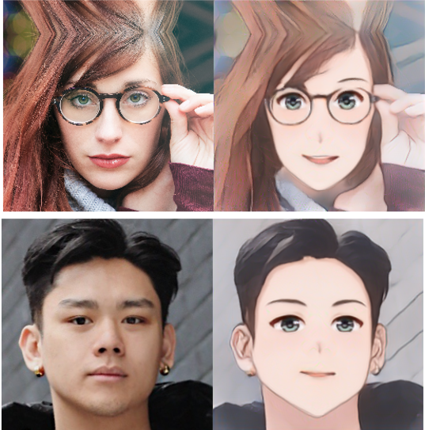](https://modelscope.cn/models/damo/cv_unet_person-image-cartoon_compound-models/summary) | [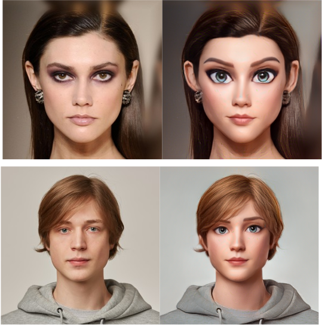](https://modelscope.cn/models/damo/cv_unet_person-image-cartoon-3d_compound-models/summary) | [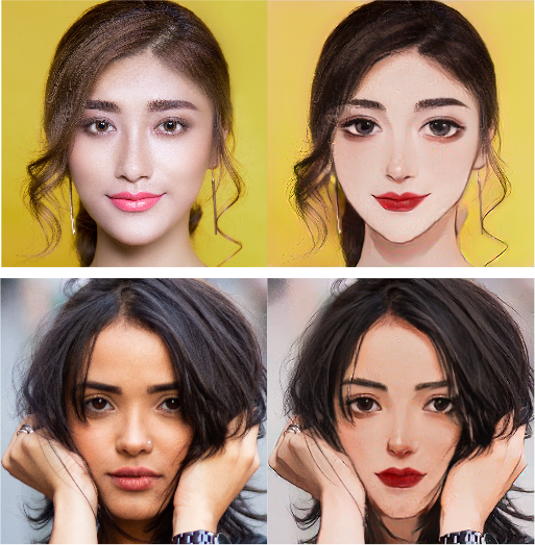](https://modelscope.cn/models/damo/cv_unet_person-image-cartoon-handdrawn_compound-models/summary)| [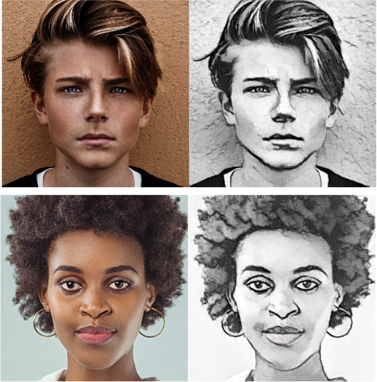](https://modelscope.cn/models/damo/cv_unet_person-image-cartoon-sketch_compound-models/summary)| [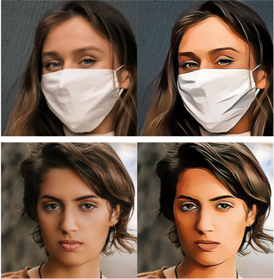](https://modelscope.cn/models/damo/cv_unet_person-image-cartoon-artstyle_compound-models/summary)|
|:--:|:--:|:--:|:--:|:--:| 
| [anime](https://modelscope.cn/models/damo/cv_unet_person-image-cartoon_compound-models/summary) | [3d](https://modelscope.cn/models/damo/cv_unet_person-image-cartoon-3d_compound-models/summary) | [handdrawn](https://modelscope.cn/models/damo/cv_unet_person-image-cartoon-handdrawn_compound-models/summary) | [sketch](https://modelscope.cn/models/damo/cv_unet_person-image-cartoon-sketch_compound-models/summary) | [artstyle](https://modelscope.cn/models/damo/cv_unet_person-image-cartoon-artstyle_compound-models/summary) | 

| [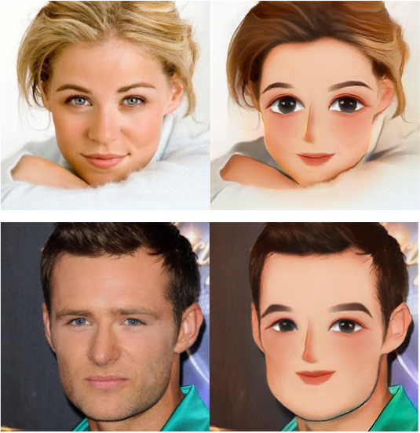](https://modelscope.cn/models/damo/cv_unet_person-image-cartoon-sd-design_compound-models/summary) | [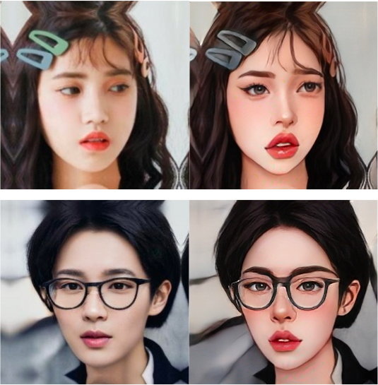](https://modelscope.cn/models/damo/cv_unet_person-image-cartoon-sd-illustration_compound-models/summary) |
|:--:|:--:| 
| [design](https://modelscope.cn/models/damo/cv_unet_person-image-cartoon-sd-design_compound-models/summary) | [illustration](https://modelscope.cn/models/damo/cv_unet_person-image-cartoon-sd-illustration_compound-models/summary)

Pre-trained models in different styles can be downloaded by
```bash
python download.py
```

### Inference

- from python SDK
```bash
python run_sdk.py
```

- from source code
```bash
python run.py
```

### Video cartoonization


video can be directly processed as image sequences, style choice [option: anime, 3d, handdrawn, sketch, artstyle, sd-design, sd-illustration]

```bash
python run_vid.py --style anime
```


## Training

### Data preparation
```
face_photo: face dataset such as [FFHQ](https://github.com/NVlabs/ffhq-dataset) or other collected real faces.
face_cartoon: 100-300 cartoon face images in a specific style, which can be self-collected or synthsized with generative models.
```
Due to the copyrighe issues, we can not provide collected cartoon exemplar for training. You can produce cartoon exemplars with the style-finetuned Stable-Diffusion (SD) models, which can be downloaded from modelscope or huggingface hubs.

The effects of some style-finetune SD models are as follows:

| [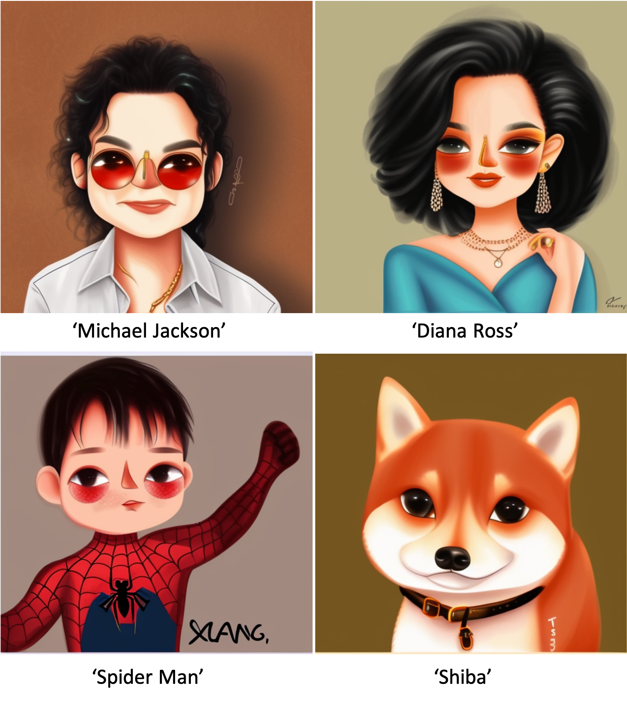](https://modelscope.cn/models/damo/cv_cartoon_stable_diffusion_design/summary) | [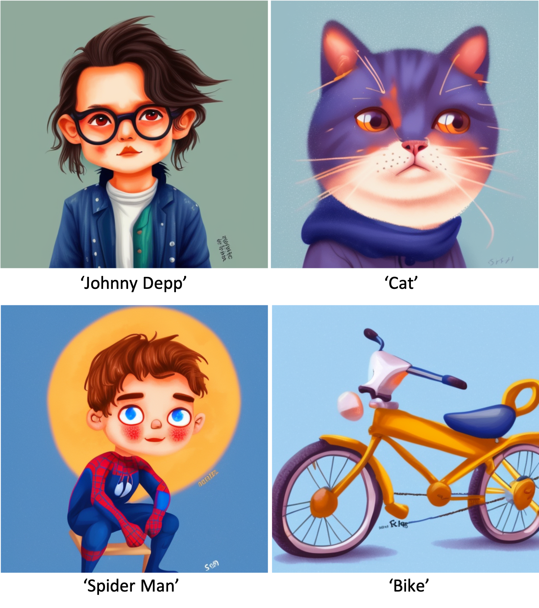](https://modelscope.cn/models/damo/cv_cartoon_stable_diffusion_watercolor) | [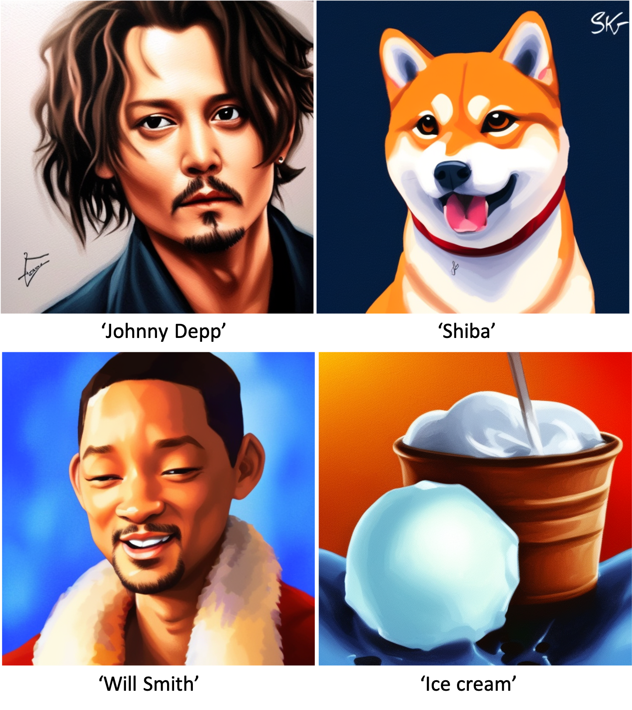](https://modelscope.cn/models/damo/cv_cartoon_stable_diffusion_illustration/summary)| [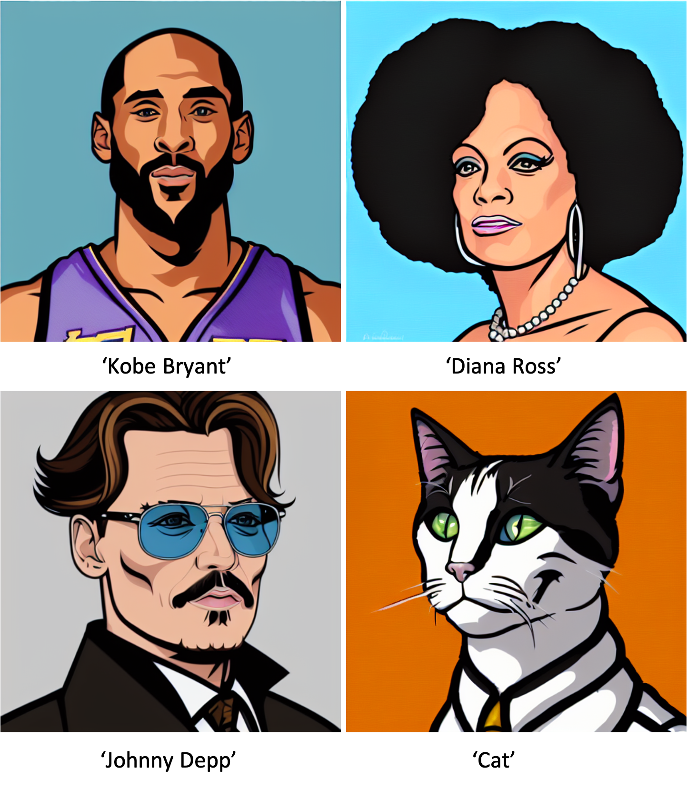](https://modelscope.cn/models/damo/cv_cartoon_stable_diffusion_clipart/summary)| [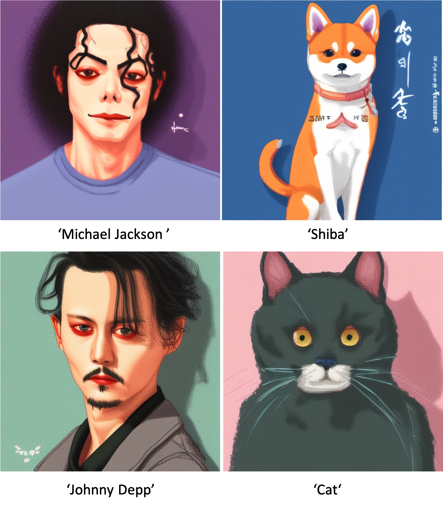](https://modelscope.cn/models/damo/cv_cartoon_stable_diffusion_flat/summary)|
|:--:|:--:|:--:|:--:|:--:| 
| [design](https://modelscope.cn/models/damo/cv_cartoon_stable_diffusion_design/summary) | [watercolor](https://modelscope.cn/models/damo/cv_cartoon_stable_diffusion_watercolor/summary) | [illustration](https://modelscope.cn/models/damo/cv_cartoon_stable_diffusion_illustration/summary) | [clipart](https://modelscope.cn/models/damo/cv_cartoon_stable_diffusion_clipart/summary) | [flat](https://modelscope.cn/models/damo/cv_cartoon_stable_diffusion_flat/summary) | 

- Generate stylized data, style choice [option: clipart, design, illustration, watercolor, flat]
```bash
python generate_data.py --style clipart
```


### Train content calibration network 
To-be-added

### Geometry calibration
To-be-added

### Train texture translator
To-be-added


## Acknowledgments

Face detector and aligner are adapted from [Peppa_Pig_Face_Engine](https://github.com/610265158/Peppa_Pig_Face_Engine
) and [InsightFace](https://github.com/TreB1eN/InsightFace_Pytorch).


## Citation

If you find this code useful for your research, please use the following BibTeX entry.

```bibtex
@inproceedings{men2022dct,
  title={DCT-Net: Domain-Calibrated Translation for Portrait Stylization},
  author={Men, Yifang and Yao, Yuan and Cui, Miaomiao and Lian, Zhouhui and Xie, Xuansong},
  journal={ACM Transactions on Graphics (TOG)},
  volume={41},
  number={4},
  pages={1--9},
  year={2022},
  publisher={ACM New York, NY, USA}
}
```


